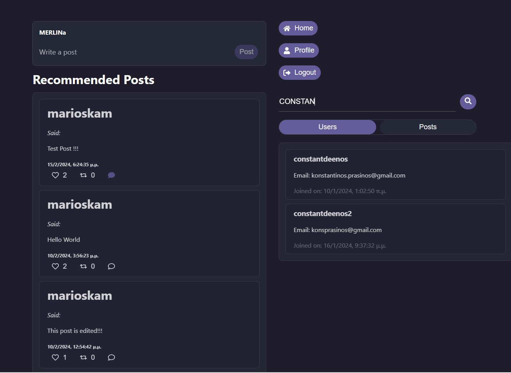

# EchoTexts - A Text-Only Social Network 🌐💬📲

## Overview
EchoTexts is a **text-only social network**, inspired by Twitter, designed and developed as a **CRUD web application** by our team of four members using agile methodology, specifically **Scrum**. It allows users to perform basic operations such as creating, reading, updating, and deleting posts, user profiles, likes, reposts, comments etc. The application follows a **three-tier architecture** consisting of front-end, back-end, and database layers.

The development of EchoTexts follows the **Git Flow methodology**, which organizes the codebase into different branches for better collaboration and version control. The main branch serves as the stable release branch, while the develop branch contains ongoing development work for the next release. Additionally, there are several feature branches (prefixed with **'feat/'**), testing branches (prefixed with **'test/'**), and fix branches (prefixed with **'fix/'**) that contain individual features, testing implementations, and bug fixes, respectively.

## Software Stack 🛠️

### Front-end 📱
- **Framework:** React
- **Communication:** RESTful web services
- **Authentication:** JWT COOKIE

### Back-end ⚙️
- **Framework:** Express with Node.js
- **API Layers:** Controllers, Routes, Data Layer (Models) each model corresponds to a table in your database
- **Dependency Injection:** Implemented

### Database 🗄️
- **Type:** PostgreSQL securely hosted in the cloud, eliminating the need for us to manage infrastructure or worry about server maintenance
- **ORM:** Prisma, automatically generates models based on the database schema defined in the prisma.schema file

### Testing 🧪
- **Integration Testing:** Jest & Supertest

## Preview 🖼️
### Below is a preview of EchoTexts, showcasing its user interface, specifically home page (Screenshots of the app can be found in the Screenshots directory):


## Prerequisites 🛠
Before running this application, ensure you have the following installed:

- Node.js and npm
- PostgreSQL
- Git

## Getting Started 🚀

To get started with EchoTexts, follow these steps:

1. **Clone the repository:**
  ```bash
  git clone https://github.com/MelinaMoraiti/EchoTexts.git
  ```
2. **Navigate to the server directory:**
  ```bash
   cd server
  ```
3. **Install client dependencies:**
  ```bash
  npm install
  ```
4. **Set up the PostgreSQL database according to the provided schema.**
5. **Configure the environment variables DATABASE_URL, PORT (Port server runs), SECRET (JWT secret) in a .env file.**
6. **Start the server:**
  ```bash
  node server.js
  ```
7. **Open a new terminal window/tab from the EchoTexts project directory.**
8. **Navigate to the client directory:**
  ```bash
  cd client
  ````
9. **Install client dependencies:**
  ```bash
  npm install
  ```
10. **Configure the environment variable for client [VITE_BACKEND_URL]  in a .env file (which is the address server runs).**
11. **Start the client:**
  ```bash
  npm start
  ```
12. **Access the application in your browser at http://localhost:[PORT CLIENT RUNS] (DEFAULT IS 5173).**

## Improvement Ideas
- **Create dockerfile for easier setup**

## Acknowledgements 🙏

- [Supabase](https://supabase.io) for providing the cloud-hosted PostgreSQL database solution.
- [Prisma](https://prisma.io) for auto-generating database models and simplifying database access.

## License 📄
EchoTexts repository is licensed under the [MIT License](./LICENSE).
